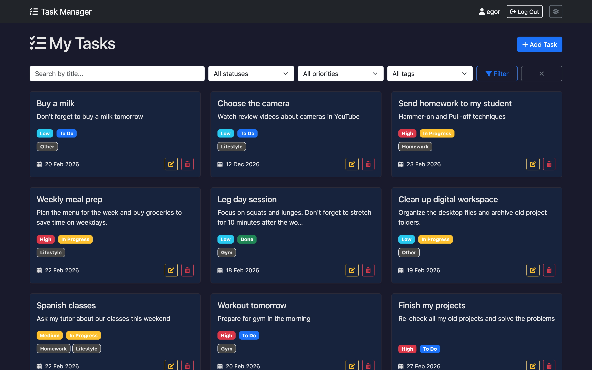
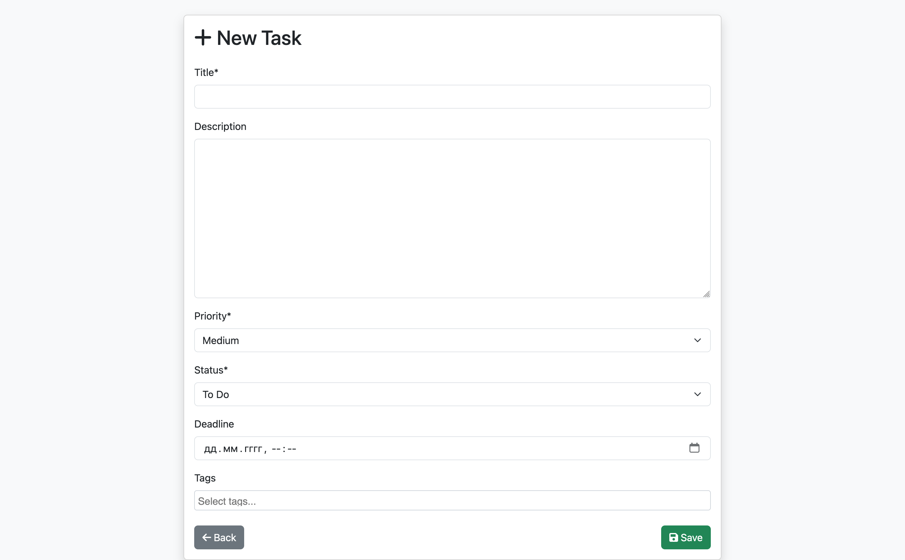
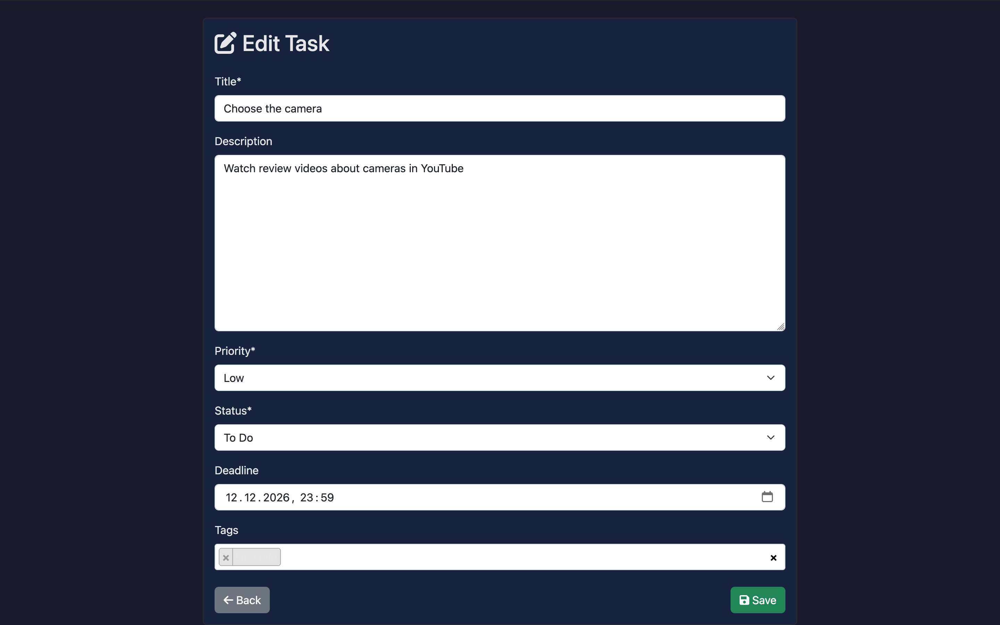

# Task Manager (To-Do list)

## 📝 Description
Django-powered task management system with user authentication, priority tagging, and deadline tracking. Perfect for personal productivity and team task organization.  

## ✨ Features

### ✅ Tasks  
- Create/Edit/Delete tasks with descriptions  
- Priority levels (High/Medium/Low)  
- Status tracking (To Do/In Progress/Done)  
- Deadline management  
- Tag system for categorization  

### 👤 User Management  
- Secure registration/login  
- Personalized task lists  
- User-specific data isolation  
- CSRF protection  

### 🎨 UI/UX  
- Responsive Bootstrap 5 design  
- Visual priority indicators (badges)  
- Intuitive task cards  
- Font Awesome icons

## 📸 Screenshots

| Task List | Task List (Night theme) | Add Task | Edit Task (Night theme) |
|-----------|--------------|-----------|-----------|
|  |  |  |  |

## 🛠 Tech Stack

**Backend:**  
- Python 3.10+  
- Django 5.0  
- PostgreSQL

**Frontend:**  
- Bootstrap 5  
- Font Awesome  
- Django-Select2 (for tag selection)  
- Flatpickr (for date/time inputs) 

## 🚀 Quick Start

### 1. Clone repo
git clone https://github.com/egorpusto/task-manager.git
cd finance-manager

### 2. Setup environment
python -m venv venv
source venv/bin/activate  # Windows: venv\Scripts\activate

### 3. Install dependencies
pip install -r requirements.txt

### 4. Configure database
1. Create PostgreSQL database task_manager_db
2. Update DATABASES in settings.py

### 5. Run migrations
python manage.py migrate

### 6. Create admin
python manage.py createsuperuser

### 7. Start dev server
python manage.py runserver

Visit:

- http://localhost:8000 - App
- http://localhost:8000/admin - Admin panel

## 🤝 Contributing
1. Fork the project  
2. Create your branch (`git checkout -b feature/amazing-feature`)  
3. Commit changes (`git commit -m 'Add amazing feature'`)  
4. Push to branch (`git push origin feature/amazing-feature`)  
5. Open a Pull Request  

## 🧪 Testing

Run tests with:

python manage.py test

## 🗂 Project Structure

- `task_manager/`
  - `tasks` — Main app
    - `migrations/` — Database migrations
    - `static/` - Static files
    - `templates/` — HTML templates
    - `__init__.py`
    - `admin.py` - Admin config
    - `apps.py`
    - `forms.py` — Transaction forms
    - `models.py` — Data models
    - `tests.py` - Unit tests
    - `urls.py` — App URLs
    - `views.py` — View logic
  - `task_manager` — Project config
    - `__init__.py`
    - `asgi.py`
    - `settings.py` — Django settings
    - `urls.py` — Project URLs
    - `wsgi.py`
  - `.env.example` - Environment variables template
  - `.gitignore` - Specifies untracked files
  - `manage.py` — Management script
  - `requirements.txt` — Dependencies

## ⚙️ Configuration

### Create .env file with:

SECRET_KEY=your-secret-key-here  
DEBUG=True  
DB_NAME=task_manager_db  
DB_USER=your_db_user  
DB_PASSWORD=your_db_password

---

Made with ❤️ by egorpusto