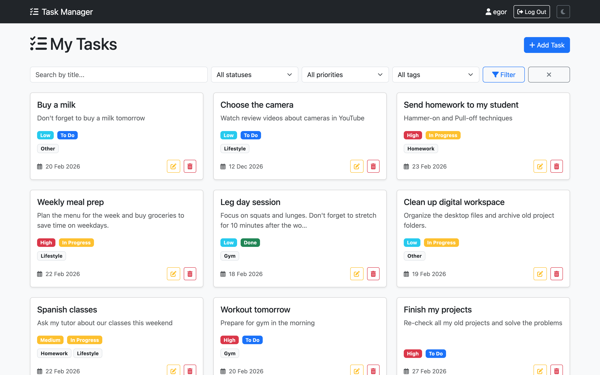
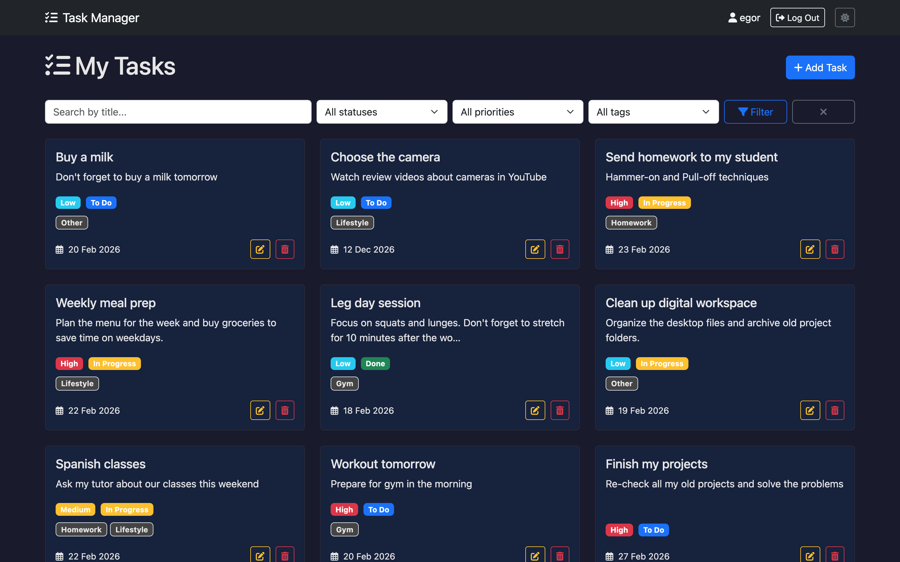
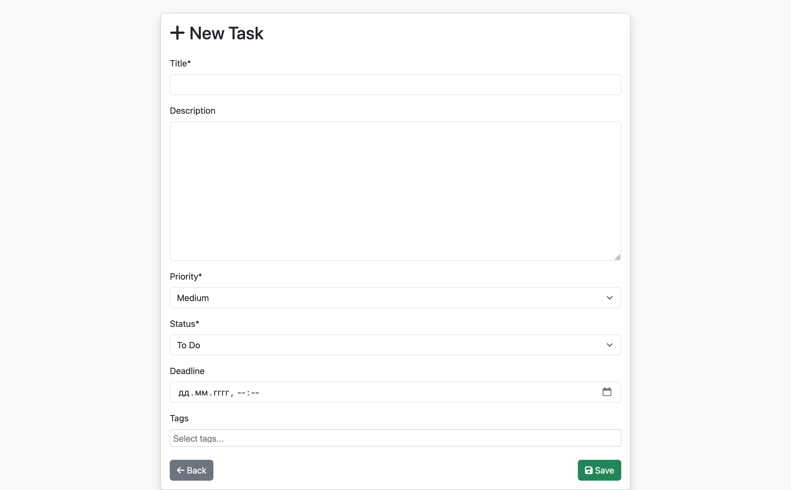
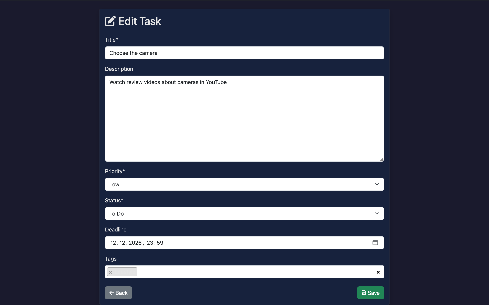

# ✅ Task Manager - Django Web Application

A full-featured task management web application built with Django, PostgreSQL, Redis, and Docker.


## 🎯 Project Overview

A clean, production-ready task manager with user authentication, task filtering, tagging system, and dark mode. Built as a portfolio project demonstrating Django best practices, Docker infrastructure, and CI/CD pipeline.

## ✨ Features

### Tasks
- ✅ Create, update, and delete tasks
- ✅ Set priority (Low / Medium / High)
- ✅ Track status (To Do / In Progress / Done)
- ✅ Set deadlines with overdue highlighting
- ✅ Tag system with Select2 autocomplete
- ✅ Search tasks by title
- ✅ Filter by status, priority, and tag
- ✅ Pagination (9 tasks per page)

### Users
- ✅ Registration and authentication
- ✅ Each user sees only their own tasks
- ✅ Protection against accessing other users' tasks

### UI
- ✅ Responsive Bootstrap 5 interface
- ✅ Dark mode with localStorage persistence
- ✅ Success/error notifications (Django messages)
- ✅ Admin panel

## 🛠️ Tech Stack

### Backend
- **Django** 5.1 - Web framework
- **PostgreSQL** 16 - Primary database
- **Redis** 7 - Cache backend (Select2, sessions)
- **Gunicorn** - WSGI server
- **Whitenoise** - Static files serving
- **python-decouple** - Environment configuration

### Frontend
- **Bootstrap** 5.3 - UI framework
- **Select2** 4.1 - Tag autocomplete
- **Font Awesome** 6 - Icons

### Infrastructure
- **Docker** & **Docker Compose** - Containerization
- **GitHub Actions** - CI/CD pipeline

### Testing
- **Django TestCase** - Unit and integration tests
- **17 tests** covering models, views, filters, and access control

## 🚀 Getting Started

### Prerequisites

- Docker & Docker Compose
- Python 3.12+

### Installation

1. **Clone the repository:**
```bash
git clone https://github.com/egorpusto/task-manager.git
cd task-manager
```

2. **Create `.env` file:**
```bash
cp .env.example .env
```

3. **Edit `.env` with your values:**
```env
SECRET_KEY=your-secret-key
DEBUG=True
ALLOWED_HOSTS=localhost,127.0.0.1

DB_NAME=task_manager_db
DB_USER=task_manager_user
DB_PASSWORD=yourpassword
DB_HOST=localhost
DB_PORT=5433

REDIS_URL=redis://127.0.0.1:6379/1
```

4. **Start PostgreSQL and Redis:**
```bash
docker-compose up -d db redis
```

5. **Create and activate virtual environment:**
```bash
python3 -m venv venv
source venv/bin/activate
pip install -r requirements.txt
```

6. **Run migrations:**
```bash
python manage.py migrate
```

7. **Create superuser:**
```bash
python manage.py createsuperuser
```

8. **Run the development server:**
```bash
python manage.py runserver
```

Open http://127.0.0.1:8000

### Run with Docker (full stack)
```bash
docker-compose up --build
```

## 🧪 Testing
```bash
python manage.py test tasks --verbosity=2
```

### Test Coverage

| Module | Tests |
|--------|-------|
| Models (Task, Tag) | 4 tests |
| Views (CRUD, access control) | 8 tests |
| Filters & Search | 3 tests |
| Signup | 2 tests |
| **Total** | **17 tests** |

## 🔄 CI/CD Pipeline

Every push and pull request to `main` triggers:

✅ **Testing** — Full test suite with PostgreSQL and Redis services  
✅ **Python 3.12** — Consistent environment across local and CI  
✅ **Auto migrate** — Migrations applied before tests  

## 🗄️ Database Schema

### Task
```
- id: BigInteger (Primary Key)
- user: ForeignKey → User
- title: VARCHAR(200)
- description: TEXT
- priority: VARCHAR(10) [low, medium, high]
- status: VARCHAR(20) [todo, in_progress, done]
- deadline: TIMESTAMP (nullable)
- tags: ManyToMany → Tag
- created_at: TIMESTAMP
- updated_at: TIMESTAMP
```

### Tag
```
- id: BigInteger (Primary Key)
- name: VARCHAR(50) UNIQUE
```

## 🏗️ Project Structure
```
task_manager/
├── manage.py
├── task_manager/           # Django project config
│   ├── settings.py
│   ├── urls.py
│   ├── wsgi.py
│   └── asgi.py
├── tasks/                  # Main application
│   ├── migrations/         # Database migrations
│   ├── static/
│   │   └── tasks/
│   │       └── css/
│   │           └── styles.css
│   ├── templates/
│   │   ├── base.html
│   │   ├── registration/
│   │   │   ├── login.html
│   │   │   ├── signup.html
│   │   │   └── logged_out.html
│   │   └── tasks/
│   │       ├── task_list.html
│   │       ├── task_form.html
│   │       └── task_confirm_delete.html
│   ├── models.py
│   ├── views.py
│   ├── forms.py
│   ├── urls.py
│   ├── admin.py
│   ├── apps.py
│   └── tests.py
├── staticfiles/            # Collected static (production)
├── .github/
│   └── workflows/
│       └── ci.yml
├── Dockerfile
├── docker-compose.yml
├── requirements.txt
├── .env.example
└── .gitignore
```

## 🐳 Docker Services

| Service | Image | Port |
|---------|-------|------|
| web | Custom (Django + Gunicorn) | 8000 |
| db | postgres:16-alpine | 5433 |
| redis | redis:7-alpine | 6379 |

### Useful Commands
```bash
# Start all services
docker-compose up -d

# View logs
docker-compose logs -f web

# Stop all services
docker-compose down

# Remove volumes (reset database)
docker-compose down -v
```

## 🔒 Security

- **CSRF protection** — All forms protected
- **Login required** — All task views require authentication
- **Object-level protection** — Users can only access their own tasks (404 on foreign objects)
- **Environment variables** — Secrets never hardcoded
- **Password validation** — Django built-in validators

## 🤝 Contributing

This is a personal learning project, but suggestions are welcome!

1. Fork the repository
2. Create a feature branch (`git checkout -b feature/amazing-feature`)
3. Commit your changes (`git commit -m 'Add amazing feature'`)
4. Push to the branch (`git push origin feature/amazing-feature`)
5. Open a Pull Request

## 📸 Screenshots

| Task List | Task List (Night theme) | Add Task | Edit Task (Night theme) |
|-----------|--------------|-----------|-----------|
|  |  |  |  |

## 👤 Author

**Egor Pusto**
- GitHub: [@egorpusto](https://github.com/egorpusto)

## 📄 License

This project is for educational purposes.